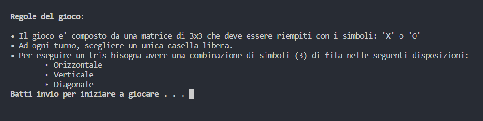
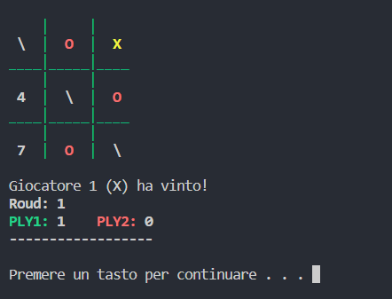
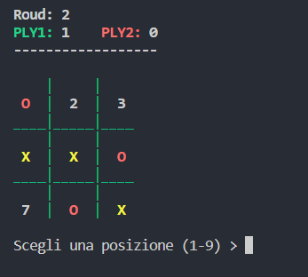

<head>
</head>
<body>
  <h1>Gioco Del Tris in C++</h1>
  
Il gioco e' veramente semplice, presenta delle regole e una CLI pulita e chiara 

  <h3>!! IMPORTANTE !!!</h3>
  
 Per poter giocare e' necessario scaricare la libreria "supporta_grafica.h" e inserirla nella stessa directory del fila "main.cpp"

  
In seguito sono riportati alcuni screen del gioco

   </>
  
Ecco la visualizzazione della tabella quando si vince (L'animazione cambia in base a dove si e' fatto tris)

   </>
  
Il gioco si riprende con le statistiche aggiornate

   </>

  
Il gioco dura all'infinito, ma potete cambiare questa condizione modificando il codice!

</body>
